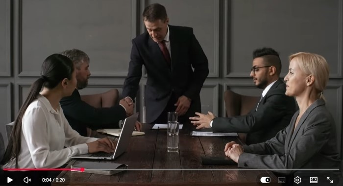
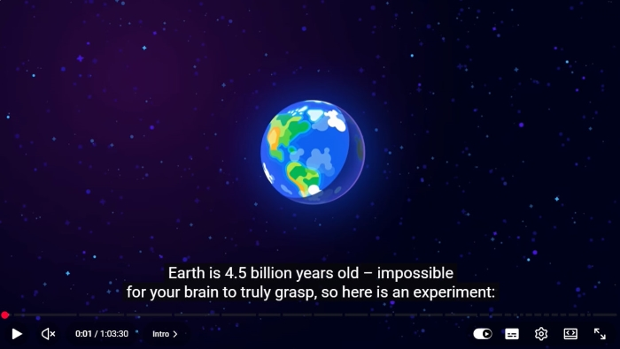

# Audio and Video <span aria-hidden="true">🎬</span>

Accessible **audio** and **video** content ensures that all users — including people with hearing, visual, or cognitive impairments — can understand and interact with media.

---

## Why It Matters

Not all users can:
- Hear audio clearly (or at all)
- See visual content
- Process fast or complex information

Without accessibility features, important information can be **lost or misunderstood**.

---

## Accessibility by User Needs

### 1. Visual Impairment → **Audio Descriptions**

Audio descriptions provide **spoken narration of important visual information** in a video, such as actions, scene changes, and on-screen text.

:::note[Note]
This applies to **video content**, where visual information is not available through audio alone.
:::

#### <span aria-hidden="true">✅</span> Benefits:
- Enables blind or visually impaired users to understand visual elements  
- Provides context that is not conveyed through dialogue or sound  
- Delivered as an **additional audio track synchronized with the video**

#### Example:



*A screenshot from the YouTube video*

> *[The man enters the room and shakes hands.]*

:::tip[Tip]
- **Purpose:** Narrate **important visual content** for blind/visually impaired users.
- **Sync:** Must be synchronized with the video.
- **Location:** Provided as a s**eparate audio track**; optionally a description panel near the video.
- **File type:** `.mp3` or integrated as a secondary track in the video.
- **Player Controls:** Required (for play/pause, description toggle).
- **Other:** Only describe **essential visuals**, keep narration concise, provide a **toggle button** to enable/disable.
:::

:::info[Link]
More information about **Descriptions** can be found here: [Description of Visual Information](https://www.w3.org/WAI/media/av/description/)
:::

---

### 2. Hearing Impairment → **Captions**

Captions provide a **textual representation of audio content**, including spoken dialogue, speaker identification, and relevant non-speech information (e.g., *[music]*, *[applause]*).

:::note[Note]
Applicable to **audio content** and **video with meaningful audio**.
:::

#### <span aria-hidden="true">✅</span> Benefits:
- Ensures accessibility for **deaf and hard-of-hearing users**  
- Enables content consumption in **sound-restricted environments**  
- Improves comprehension for **non-native speakers**  

#### <span aria-hidden="true">⚠️</span> Implementation Considerations:
- **Automatic captions should be reviewed**, as they may contain recognition errors  
- Include **non-speech elements** (e.g., sound effects, tone, music cues)  
- Ensure proper **synchronization with audio**  

#### Example:



*A screenshot from the YouTube video*

#### Code Example:

```html
<video controls> 
  <source src="video.mp4" type="video/mp4" /> 
  <track src="captions.vtt" kind="subtitles" srclang="en" label="English"> 
</video>
```

:::tip[Tip]
- **Purpose:** Show **spoken dialogue and important sounds**.
- **Sync:** Must be synchronized with audio.
- **Location:** Directly associated with the video — embedded via `<track>` in `<video>` or in a visible caption area below the video.
- **File type:** `.vtt` (WebVTT) or `.srt` files.
- **Player Controls:** Required (for play/pause, caption toggle).
- **Other:** Include speaker names and non-speech sounds (`[applause]`, `[music]`). Should be toggleable.
:::

:::info[Link]
More information about **Captions** can be found here: [Captions/Subtitles](https://www.w3.org/WAI/media/av/captions/)
:::

### 3. Deafblind Accessibility → **Transcripts**

Transcripts provide a **complete text alternative for audio and video content**, including spoken dialogue, speaker identification, non-speech audio (e.g., *[music]*), and relevant visual information.

:::note[Note]
Applicable to **audio** and **video** content. Transcripts are also useful for users who prefer or require **text-based access**.
:::

#### <span aria-hidden="true">✅</span> Benefits:
- Ensures accessibility for **deafblind users** via assistive technologies  
- Provides full content access through **screen readers** and **refreshable braille displays**  
- Enables users to **read, search, and navigate** content at their own pace  
- Preserves all information in a **text-based, machine-readable format**  

#### <span aria-hidden="true">⚠️</span> Implementation Considerations:
- Include both **audio and visual information** in the transcript  
- Clearly identify **speakers** and **contextual details**  
- Maintain a logical and **structured format** for readability and navigation  

#### <span aria-hidden="true">⚙️</span> Assistive Technology Support:
Transcripts are typically accessed using:
- **Screen readers** (text-to-speech output)  
- **Refreshable braille displays** (tactile output for non-visual reading)

#### Example:

```jsx live
<div>
  <audio controls aria-describedby="transcript">
    <source src="/podcast.mp3" type="audio/mpeg" />
  </audio>

  <div id="transcript" style={{ marginTop: '1rem' }}>
    <p><em>[Intro music]</em></p>
    <p>
      <strong>Speaker:</strong> Welcome to our podcast about web accessibility. 
      Today we will discuss how to make audio and video content more inclusive...
    </p>
  </div>
</div>
```

:::tip[Tip]
- **Purpose:** Full **text alternative** for audio and video content.
- **Sync:** Not required to be in real-time, but **timestamps optional**.
- **Location:** Place **below or next to media player**. Clearly label with `aria-describedby` or headings for screen readers.
- **File type:** `.txt`, `.html`, `.md`, or embedded in page content.
- **Player Controls:** Not required (text-only).
- **Other:** Include **speaker names**, **sound cues**, and visual context. Structure for readability.
:::

:::info[Link]
More information about **Transcripts** can be found here: [Transcripts](https://www.w3.org/WAI/media/av/transcripts/)
:::

---

## Key Idea <span aria-hidden="true">💡</span>

Accessibility features such as **audio descriptions, captions, and transcripts** are not only essential for users with visual, hearing, or combined impairments.

They also improve usability for a wider audience, including users who:
- Prefer **text-based information** over audio or visual content  
- Are in **noisy or quiet environments** where audio cannot be used  
- Are **non-native speakers** who benefit from reading along  
- Need to **search, review, or process information at their own pace**

:::info[Link]
Read more here: 
- [Making Audio and Video Media Accessible](https://www.w3.org/WAI/media/av/)
- [Adding captions and subtitles to HTML video](https://developer.mozilla.org/en-US/docs/Web/Media/Guides/Audio_and_video_delivery/Adding_captions_and_subtitles_to_HTML5_video)
:::