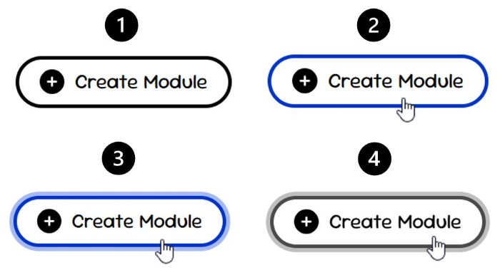

# Focus Management 🎯

**Focus** is a key concept in web accessibility that ensures users can clearly identify which element on a page is currently active or ready for interaction.

:::note[Note]
In technical terms, **focus is the state in which a user interface element is selected and can receive input**, typically triggered by keyboard navigation, mouse interaction, or assistive technologies.
:::

Accessible focus design improves usability, navigation, and overall user experience.

---

## Why Focus Matters

Not all users interact with a website using a mouse. Many rely on:

- **Keyboard navigation**  
- **Screen readers**  
- **Assistive technologies**  

Without visible focus indicators, users may lose track of their position on the page, making interaction difficult or impossible.

:::note[Note]
According to accessibility guidelines (WCAG), interactive elements must provide a **clearly visible focus indicator** to support keyboard navigation. [Focus Visible (Level AA)](https://www.w3.org/WAI/WCAG22/Understanding/focus-visible.html)
:::

---

## Interaction Scenarios

When implementing focus, multiple interaction methods must be considered:

1. **Mouse hover** ➜ [`:hover`](#hover)
2. **Focus state (active element)** ➜ [`:focus`](#focus)
3. **Keyboard navigation** ➜ [`:focus-visible`](#focus-visible-recommended)
4. **Users with colour vision deficiencies** ➜ [Accessibility for Colour-Blind Users](#accessibility-for-colour-blind-users-)

All scenarios should provide clear and consistent visual feedback.

---

## Keyboard Navigation ⌨️

Keyboard navigation is the primary mechanism that makes focus essential.

Users navigate websites using:

- `Tab` ➜ move forward  
- `Shift + Tab` ➜ move backward  
- `Enter` ➜ activate element

:::tip[Tip]
More information about **keyboard shortcuts** and keyboard navigation: [Keyboard Accessibility](https://webaim.org/techniques/keyboard/)
:::

## Hover vs Focus 🖱️

It is important to distinguish between these states:

- **`:hover`** → triggered by mouse movement  
- **`:focus` / `:focus-visible`** → triggered by interaction or keyboard navigation  

:::caution[Attention]
**Focus must always remain visible**, even when a mouse is not used.
:::

---

## `:hover`

Hover effects provide immediate feedback for mouse users by indicating that an element is interactive.

```css
.button:hover {
  background-color: #e0e0e0;
}
```

## `:focus`

The focus state indicates that an element is selected and ready for interaction.

```css
.input:focus {
  outline: none;
  border-color: #0033cc;
  box-shadow: 0 0.5rem 1rem rgba(0, 0, 0, 0.2);
}
```

:::caution[Attention]
The **default browser outline** is removed (`outline: none`), but it is replaced with a custom visual indicator (border and shadow).

Removing outlines without providing an alternative leads to inaccessible interfaces.
:::

**Best practices:**
- Always provide a visible focus indicator
- Replace default outline if removed
- Use multiple visual cues (colour + shadow + movement)

## `:focus-visible` (Recommended)

The `:focus-visible` pseudo-class allows developers to display focus indicators only when needed, typically for keyboard users.

```css
.button:focus-visible {
  outline: 0.25rem solid #005fcc;
}
```

**Benefits:**
- Improves accessibility for keyboard users
- Reduces unnecessary visual feedback for mouse users
- Ensures consistent behavior across browsers

## Live Example 🎮

```html live
function AccessibleForm() {
  const [msg, setMsg] = React.useState("");

  return (
    <div>
      <style>{`
        .form {
          max-width: 300px;
          display: flex;
          flex-direction: column;
          gap: 10px;
        }

        .form input {
          padding: 8px;
          border: 2px solid #ccc;
          outline: none;
          transition: all 0.2s;
        }

        /* focus */
        .form input:focus {
          border-color: #0033cc;
          box-shadow: 0 0.5rem 1rem rgba(0, 0, 0, 0.15);
        }

        .form button {
          padding: 8px 12px;
          border: 3px solid transparent;
          background-color: #f0f0f0;
          cursor: pointer;
          transition: all 0.2s;
        }

        /* hover */
        .form button:hover {
          background-color: #b9b9b9;
        }

        /* focus-visible */
        .form button:focus-visible {
          border-color: #005fcc;
          outline: none;
        }

        .form p {
          margin-top: 5px;
        }
      `}</style>

      <form
        className="form"
        onSubmit={(e) => {
          e.preventDefault();
          setMsg("✅ Account created successfully!");
        }}
      >
        <input type="text" placeholder="Full name" defaultValue="Sam Tomson" required />
        <input type="email" placeholder="Email address" defaultValue="user@example.com" required />
        <input type="password" placeholder="Password" defaultValue="password123" required />

        <button type="submit">Create account</button>

        {msg && <p>{msg}</p>}
      </form>
    </div>
  );
}
```
> Use `Tab` to navigate through the inputs and button. Focus may move outside the demo, but only 4 interactive elements are included here.

**How to test:**

- **Keyboard Navigation** — use `Tab`, `Shift + Tab`, and `Enter`.

  When navigating this form using the `Tab` key, focus moves in the following order:

  1. Name input  
  2. Email input  
  3. Password input  
  4. Create Account button (press `Enter` to submit the form)

  *If these elements were the only focusable elements on the page, focus would return to the first element after the last one.*

- **`:hover`** — hover over the "Create Account" button.  
  The background changes from white to grey.

- **`:focus`** — click on any input field.  
  A blue border and shadow will appear, indicating that the element is active.

- **`:focus-visible`** — use `Tab` to navigate to the button.  
  When the button is focused via keyboard, a blue border appears.  
  Clicking or hovering only changes the background colour.

  For **mouse users**, the indicator is less visually prominent (background change from white to grey), as they navigate through the website independently.  

  In contrast, for **keyboard users**, the focus indicator is more visible (blue border), as they need to understand their current position while navigating step by step.

  :::caution[Attention]
  In this example, a border is added so that users can recognize the focused element even without relying on color. If only the color of the border changes, some users may not perceive the difference. More details are provided in the next section.
  :::

## Accessibility for Colour-Blind Users 🎨

Relying only on colour is insufficient for accessible design, as some users may not perceive colour differences.

:::tip[Tip]
For guidance on choosing accessible colour combinations, see the **[Colour Selection](../preparation/colours)** section.
:::

**❌ Incorrect:**

Using only colour changes to indicate focus or interaction.

**✅ Correct:**

Combine multiple visual indicators:
- Border
- Shadow
- Background change
- Icons or text

```css
.button:focus {
  border-color: #005fcc;
  box-shadow: 0 0 0 3px rgba(0, 95, 204, 0.5);
}
```
This approach ensures that focus remains visible even in grayscale or low-contrast conditions.

**Example:**



**Explanation of the example:**

1. **Default state**  
   The button has a standard black border with no additional visual indicators.

2. **Colour-only change (hover)**  
   The border changes from black to blue when hovered.  
   This relies solely on colour and may not be noticeable for users with colour vision deficiencies.

3. **Multiple visual indicators (hover)**  
   The button uses both a blue border and a shadow.  
   The added shadow provides an additional visual cue, making the interaction more noticeable.

4. **Grayscale simulation**  
   The same button is shown in grayscale to simulate how users with limited colour perception may experience it.  
   The border colour change alone becomes difficult to distinguish, while the shadow remains visible.

This example demonstrates why relying only on colour is insufficient and highlights the importance of combining multiple visual indicators.

## Pointer Feedback 👆

Mouse pointer styles convey interactivity and help users understand which elements can be clicked:

> Usually, **pointer** styles are **correct by default** in browsers, but it's good practice to check that interactive and non-interactive elements are distinguishable.

| Pointer Type        | Example | Description |
|--------------------|--------|-------------|
| **Default pointer** |  | Indicates a non-interactive element. |
| **Pointer (hand)**  |  | Indicates a clickable or interactive element (e.g., links, buttons). |

These behaviours should remain consistent across the application.

:::info[Link]
These cursors and others can be found here: **[About Cursors](https://learn.microsoft.com/en-us/windows/win32/menurc/about-cursors)**
:::

:::tip[Tools to Test]
Developers can **verify focus management and keyboard accessibility** using accessibility tools such as:

- **Manual testing** – Navigate the interface using `Tab` / `Shift + Tab` and check focus indicators on all interactive elements.  
  *Ensures that keyboard navigation, tab order, and visible focus are logical and usable for real users.*

- **Screen readers** like `NVDA` – [Download NVDA](https://www.nvaccess.org/download/)  
  *Simulates how assistive technologies announce focus changes, helping verify logical tab order and focus visibility for keyboard users.*

- `Stark` – [Stark Website](https://www.getstark.co/for-developers/)  
  *Checks visual focus order and contrast for interactive elements, including color-blind accessibility.*

- `WAVE evaluation tool` – [WAVE Website](https://wave.webaim.org/)  
  *Visually highlights focusable elements and missing focus indicators in the rendered page, helping developers spot inaccessible components.*

- `Storybook` – [Storybook Website](https://storybook.js.org/)  
  *Allows isolated testing of focus behavior and keyboard navigation on individual UI components before integration.*

These tools help ensure that **keyboard navigation, tab order, and visible focus indicators** are correctly implemented and functional for all users.
:::

## Key Idea 💡

- **Hover (`:hover`)** – Provides immediate visual feedback for mouse users, e.g., background change.  
- **Focus (`:focus`)** – Indicates the active element; always use clear visual cues like border, shadow, or background.  
- **Focus-visible (`:focus-visible`)** – Highlights elements for keyboard users only, reducing visual noise for mouse users.  
- **Colour accessibility** – Never rely solely on colour; combine multiple indicators (border, shadow, background, icons/text).  
- **Pointer feedback** – Use consistent cursor styles to indicate interactivity.  

**Common mistakes:** removing outlines without alternatives, relying only on colour, ignoring keyboard navigation, inconsistent focus styles.