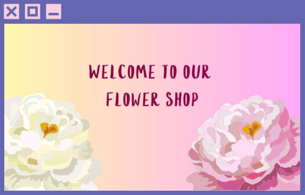
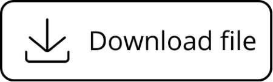

# Images and Alt Text <span aria-hidden="true">🖼️</span>

Images are an essential part of modern web applications, but they can also create barriers for users with visual impairments if not implemented correctly. Using descriptive alternative text (alt text) ensures that users relying on screen readers or other assistive technologies can understand the content and purpose of images.

---

## What This Section Covers
- Importance of alt text for accessibility
- Guidelines for writing effective alt text
- When alt text is not required
- Best practices for icons and UI graphics

---

## Importance of Alt Text
- Provides a textual alternative for users who cannot see the image.
- Helps screen readers convey the meaning and function of images.
- Improves accessibility compliance (WCAG 2.1, Level A & AA).

---

## Writing Effective Alt Text

### 1. Informative Images
Describe the **key information** the image provides.

**Image:**


*An image of Saucony brand of running shoes from [The Sports Room](https://thesportsroom.ie/collections/saucony?srsltid=AfmBOoqWz5T8FtZSMs7trvyGotdjL58Cl4_NWLwojSag4JoUI-v77oju)*

**<span aria-hidden="true">❌</span> Bad:**
```html

```

**<span aria-hidden="true">✅</span> Good:**
```html

```

### 2. Functional Images (Clickable)

Describe the action, not the appearance.

**Image:**


**<span aria-hidden="true">❌</span> Bad:**
```html
<input type="text" placeholder="Search">

```

**<span aria-hidden="true">✅</span> Good:**
```html
<input type="text" placeholder="Search">

```

### 3. Images Containing Text

Include the same text in the alt attribute.

**Image:**


**<span aria-hidden="true">❌</span> Bad:**
```html

```

**<span aria-hidden="true">✅</span> Good:**
```html

```

### 4. Complex Images (Charts, Infographics)

Provide a short alt + detailed explanation nearby.

**Image:**


```html

<p>
    From 2022 to 2025, the sales revenue increased from 20 to 70, 
    with the largest growth in 2024 from 45 to 70...
</p>
```

**Optional semantic approach:**

For better HTML semantics, you can wrap the chart in a `<figure>` and include a `<figcaption>` for the detailed description:
```html
<figure>
  
  <figcaption>
    From 2022 to 2025, the sales revenue increased from 20 to 70, 
    with the largest growth in 2024 from 45 to 70.
  </figcaption>
</figure>
```
>Using `<figure>` and `<figcaption>` improves semantic structure and can help assistive technologies better associate the image with its description.

## When Alt Text Is Not Required

### Decorative Images

If the image adds no meaning, use an empty alt attribute:



```html
<div class="welcome">
  
  <p>Welcome to our flower shop</p>
</div>
```
In this example the pink background with flowers is a website background and does not have any vital information.

### Redundant Images

If the same information is already clearly described in text:


```html
<div class="weather">
  <p>Temperature: 22°C, sunny</p>
  
</div>
```
The icon visually represents “sunny”, which is already provided in text. Screen reader users would not gain any additional information.

## Icons and UI Elements

### Decorative Icons

Used only for visual styling:



```html
<button>
  
  Download file
</button>
```
The text “Download file” already explains the action. Reading both would be repetitive.

### Informative Icons

Convey meaning (status, alerts, etc.):


```html
<div class="alert">
  
  <p>Password is too weak</p>
</div>
```

### Icon-Only Buttons

Must always have an accessible name:


*Uicons by [Flaticon](https://www.flaticon.com/uicons)*

```html
<button>
  
</button>
```
Using a `<button>` element with an image and descriptive `alt` text ensures that screen readers recognize the element as a button and announce its purpose. This approach also provides a fallback for sighted users if the image fails to load.

:::info[Link]
Learn more about making icons and images accessible: **[Functional Images](https://www.w3.org/WAI/tutorials/images/functional/)**
:::

:::tip[Tools to Test]
Developers can **verify image accessibility and alt text** using tools such as:

- **Screen readers** like `NVDA` – [Download NVDA](https://www.nvaccess.org/download/)  
  _Simulates how visually impaired users experience images and icons, confirming that alt attributes convey the intended information._

- `Stark` – [Stark Website](https://www.getstark.co/for-developers/)  
  _Checks presence of alt text in UI components and ensures images convey meaning during design and development._

These tools help ensure that **all images, icons, and functional elements** are accessible and properly announced by assistive technologies.
:::

## Key Idea <span aria-hidden="true">💡</span>

Using `alt` text ensures images are accessible and meaningful for all users, especially those relying on screen readers.

- **Alt text conveys purpose**, not just appearance, describing what users would miss if they couldn’t see the image.
- Keep it **short but meaningful**, avoiding file names or overly long descriptions.
- Use `alt=""` for **decorative** or **redundant images**, so removing them does not cause loss of important content.
- **Functional images** and **icon-only buttons** must have descriptive `alt` text to indicate their action.
- Always **test with a screen reader** to confirm clarity and accessibility.