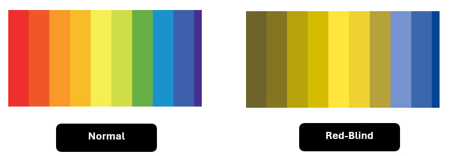
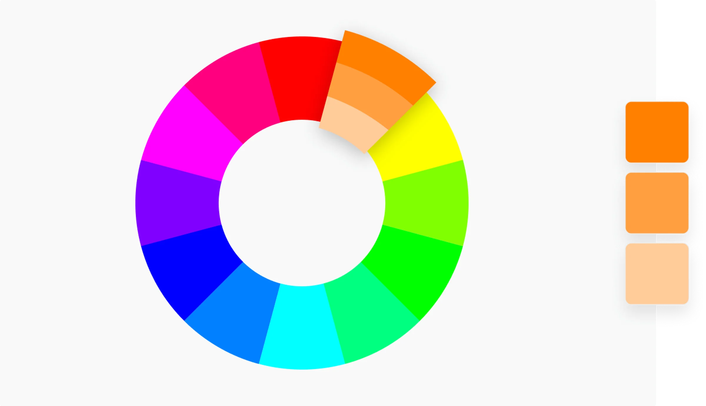
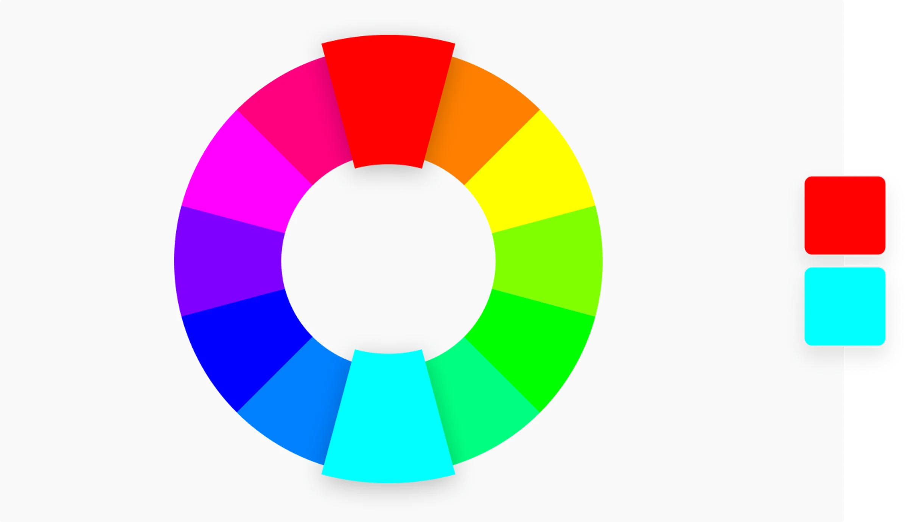
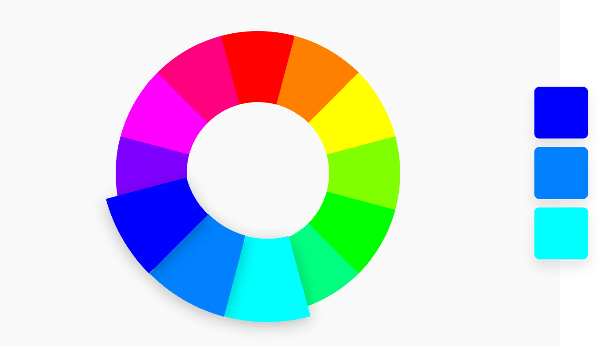
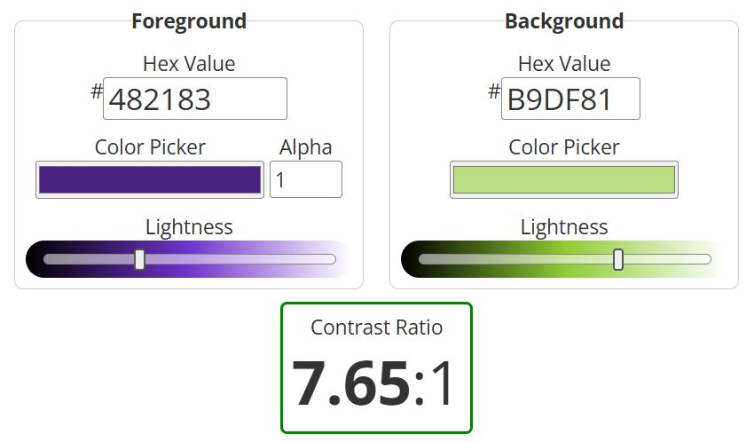

# Colours Selection

This section provides an overview of colour fundamentals and explains their role in ensuring accessible web design.

---

## Why Colours Matter 🎨

Colours can evoke **different emotions and reactions** depending on the user. For example:

- **Red** is often associated with danger, errors, or urgency  
- **Green** can indicate success or safety  
- **Blue** is commonly linked to calmness, focus, and trust  
- **Yellow** is often associated with attention, warning, or energy  
- **Purple** is commonly linked to creativity, imagination, and luxury  

However, these meanings are not universal. Cultural background, personal experience, and cognitive differences may influence how users perceive colours. Therefore, when designing accessible web applications, colours should **not be the only way to convey information**.

---

## Colour Blindness and User Consideration🧬

When designing accessible web applications, it is important to consider users with **colour vision deficiencies** (commonly referred to as colour blindness). Colour blindness affects how individuals perceive colours and may impact their ability to distinguish between certain colour combinations.  

### Common Types of Colour Blindness

1. **Protanopia (Red-Blind)**  
   - Individuals have reduced sensitivity to red light.  
   - Red hues may appear darker or indistinguishable from green.  
   - **Implication:** Avoid using red as the sole indicator of errors or warnings.

*Visual comparison of the original colour palette from [Spi-des-ign](https://www.spi-des-ign.co.uk/news/website-colours/) under normal vision and as perceived by individuals with Protanopia (Red-Blind). The simulation was made using the Stark tool.*

2. **Deuteranopia (Green-Blind)**  
   - Individuals have reduced sensitivity to green light.  
   - Green and red may appear similar, causing difficulty in differentiating status indicators.  
   - **Implication:** Use patterns or text labels in addition to colour coding.

*Visual comparison of the original colour palette from [Spi-des-ign](https://www.spi-des-ign.co.uk/news/website-colours/) under normal vision and as perceived by individuals with Deuteranopia (Green-Blind). The simulation was made using the Stark tool.*

:::note Note
**Protanopia** and **Deuteranopia** are both **red–green** colour deficiencies. Visually, the difference is subtle — in Protanopia, red appears darker, while in Deuteranopia, green appears duller. In practice, design strategies are similar for both types.
:::

3. **Tritanopia (Blue-Blind)**  
   - Individuals have reduced sensitivity to blue light.  
   - Blue and yellow may be difficult to distinguish.  
   - **Implication:** Avoid relying exclusively on blue/yellow contrasts for important information.

*Visual comparison of the original colour palette from [Spi-des-ign](https://www.spi-des-ign.co.uk/news/website-colours/) under normal vision and as perceived by individuals with Tritanopia (Blue-Blind). The simulation was made using the Stark tool.*

4. **Achromatopsia (Total Colour Blindness)**  
   - Individuals perceive the world in shades of grey.  
   - Rare, but they are unable to distinguish colours at all.  
   - **Implication:** Ensure that information is conveyed through multiple visual cues, such as contrast, shape, or text.

*Visual comparison of the original colour palette from [Spi-des-ign](https://www.spi-des-ign.co.uk/news/website-colours/) under normal vision and as perceived by individuals with Achromatopsia (Total Colour Blindness). The simulation was made using the Stark tool.*

### Design Recommendations for Colour Blind Users

- Use **high-contrast colour combinations** that are distinguishable even for common types of colour blindness.  
- Supplement colour coding with **text, icons, or patterns**.  
- Test the application with **colour blindness simulators** to verify usability.  
- Avoid relying solely on red/green combinations to convey meaning.  

:::info Link
Colour blindness simulations can be performed using online tools. For example:

- **Coblis — Colour Blindness Simulator** (https://www.color-blindness.com/coblis-color-blindness-simulator/) allows you to upload images and see how they appear to different types of colour-blind users.  
- **Stark** (https://www.getstark.co/for-developers/) can simulate colour-blindness **directly inside your web application** during development, helping to test accessibility in real-time.
:::

---

## Understanding Colour Palette and Colour Theory 🧩

A **colour palette** is a limited set of colours used consistently across a web application to create a clear and recognizable visual identity. (https://coolors.co/)

Designers often rely on the **colour wheel** to select harmonious colour combinations. (https://www.canva.com/colors/color-wheel/)

Common approaches include:

- **Monochromatic** – variations of a single colour

*Example of a Monochromatic colour scheme (source: [Canva Color Wheel](https://www.canva.com/colors/color-wheel/)).*

- **Complementary** – colours opposite each other on the colour wheel

*Example of a Complementary colour scheme (source: [Canva Color Wheel](https://www.canva.com/colors/color-wheel/)).*

- **Analogous** – colours next to each other on the wheel

*Example of a Analogous colour scheme (source: [Canva Color Wheel](https://www.canva.com/colors/color-wheel/)).*

For accessibility and usability, it is recommended to:

- Keep the palette **simple and consistent**  
- Ensure **high contrast** between elements  
- Use colours to **support**, not replace, meaning  

---

## Accessibility and WCAG 📏

To ensure accessibility, colour choices should follow the **Web Content Accessibility Guidelines (WCAG)** (see [WCAG section](./wcag)).

One of the most important requirements is **colour contrast**, which ensures that text remains readable against its background.

According to WCAG:

- **Level AA:**
  - Normal text: at least **4.5:1**
  - Large text: at least **3:1**

- **Level AAA:**
  - Normal text: at least **7:1**
  - Large text: at least **4.5:1**

:::info Link
You can find the complete **Web Content Accessibility Guidelines (WCAG)** here: [WCAG Guidelines](https://www.w3.org/TR/WCAG22/)
:::

---

## Contrast Evaluation 🔍

The selected colours can be tested using an online contrast checker (WebAIM).

As an example, the contrast between the colours `#482183` (dark purple) and `#B9DF81` (light green) was evaluated:

- `#482183` was used as the **text colour**, while `#B9DF81` was used as the **background colour**  
- The contrast ratio between these colours is **7.65:1**  
- This satisfies **WCAG AAA requirements** for normal text (minimum 7:1)  
- It also exceeds **WCAG AA requirements** (minimum 4.5:1 for normal text)  

This means the colour combination is suitable for both **regular and large text**, ensuring good readability for users with visual impairments.

*Screenshot of the contrast results (source: [WebAIM Contrast Checker](https://webaim.org/resources/contrastchecker/?fcolor=482183&bcolor=B9DF81)).*

:::info Link
You can try by yourself in **WebAIM Contrast Checker** here: [Contrast Checker](https://webaim.org/resources/contrastchecker/)
:::

---

## Key Idea 💡

A well-designed colour palette improves both **usability and accessibility**.  

By combining a minimalistic design, thoughtful colour selection, and WCAG-compliant contrast, the application ensures:

- Better readability  
- Improved user focus  
- Accessible interaction for a wide range of users  

Colours should always act as a **supporting element**, guiding users visually while maintaining clarity and inclusiveness.