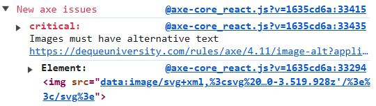

# axe-core/react

`@axe-core/react` is a library that detects accessibility issues in React applications during development.

---

## Why use it?

- Detects WCAG violations automatically  
- Integrates directly into React  
- Provides instant feedback in the console  

## When to use it?

During the development phase.

## How to use it

### 1. Install

```bash
npm install --save-dev @axe-core/react
```

:::tip[Tip]
Using `--save-dev` ensures that the `@axe-core/react` library is installed as a **development dependency**. This means it will only be used during development and will not be included in the production build.
:::

### 2. Configure

Add to your main file (e.g., `index.js`; `main.tsx`):

```js
import React from "react";
import ReactDOM from "react-dom";
import App from "./App";

if (process.env.NODE_ENV !== "production") { // Accessibility checks only during the development
  const axe = require("@axe-core/react");
  axe(React, ReactDOM, 1000);
}

ReactDOM.render(<App />, document.getElementById("root"));
```

:::caution[Caution]
It is crucial to run `@axe-core/react` in **development** environment, as it may negatively impact performance in a production environment.
:::

### 3. Run your app

Issues will appear in the browser console.

**Example:**



In this example, the image does not have alternative text (`alt`), which results in an error message in the console.

## Limitations

- Cannot detect usability issues
- Requires developer interpretation

## Tips & Best Practices 💡

- Use only in **development mode**
- Fix issues immediately to avoid accumulation
- Combine with manual testing

:::info[Link]
More information: **[GitHub axe-core/react](https://github.com/dequelabs/axe-core-npm/tree/develop/packages/react)**
:::