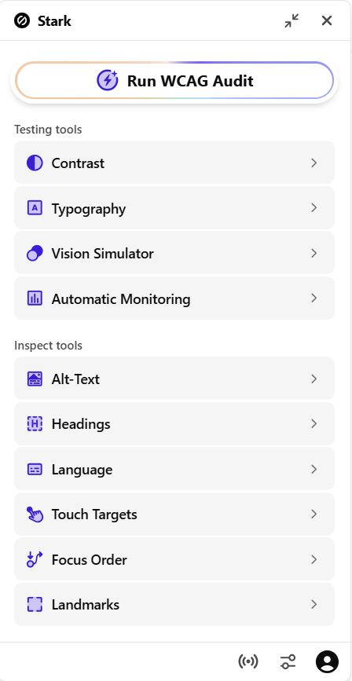

# Stark

## What is this tool?

**Stark** is a tool for testing visual accessibility aspects, including color contrast and color vision deficiencies.

---

## When to use it?

During the design and development phases.

## How to use it

### 1. Install

Install the browser extension: (**[Chrome extension](https://chromewebstore.google.com/detail/stark-accessibility-check/fkfaapnmfippddbeemjjbclenphooipm)**)

> Extensions are also available on the official Stark website for: `Firefox`, `Edge`, `Safari`, `Arc`, and `Brave`.

Alternatively, for design: **[Figma plugin](https://www.figma.com/community/plugin/732603254453395948/stark-contrast-accessibility-checker)** 

### 2. Select what you want to test:

## What to test

- Text contrast  
- Focus indicators  
- Color combinations
- Other visual accessibility aspects 

## Limitations

- Only visual testing

## Tips & Best Practices 💡

- Always meet WCAG contrast standards  
- Avoid color-only meaning

:::info Link
More information: **[Stark for Developers](https://www.getstark.co/for-developers/)**
:::