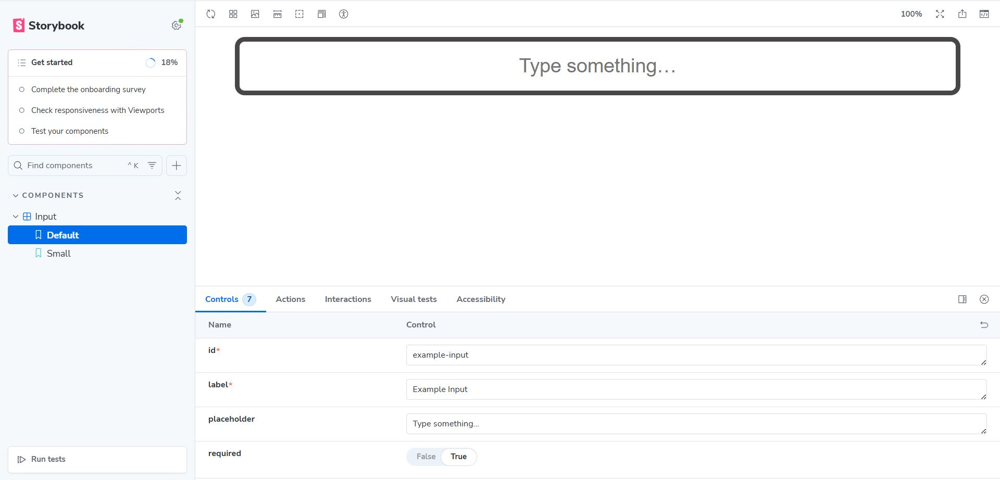

# Storybook (Component-Level Testing)

**Storybook** allows developers to build and test UI components in isolation.

---

## Why use it?

- Test components individually  
- Detect issues at an early stage  

## How to use it

### 1. Install Storybook

```bash
npm create storybook@latest
```

:::info[Link]
More information about installation: **[Install Storybook](https://storybook.js.org/docs/get-started/install)**
:::

### 2. Create component stories

**Example:**

`Input.stories.tsx`

```tsx
import { useState } from 'react'
import type { Meta, StoryFn } from '@storybook/react'
import UIInput from './Input'

export default {
    title: 'Components/Input',
    component: UIInput,
} as Meta

const Template: StoryFn<any> = (args) => {
    const [value, setValue] = useState('')
    return <UIInput {...args} value={value} onChange={(e) => setValue(e.target.value)} />
}

export const Default = Template.bind({})
Default.args = {
    id: 'example-input',
    label: 'Example Input',
    placeholder: 'Type something…',
    required: true,
    size: 'large',
}

export const Small = Template.bind({})
Small.args = {
    ...Default.args,
    size: 'small',
}
```

For demonstration, a separate `Input` component was created to handle text input fields consistently across the application.

**Defined states include:**  
- **Default:** the standard input field with a label, placeholder, and required attribute.  
- **Small:** a smaller variant of the input for compact layouts.  
- *(Additional states such as disabled, error, or focus can also be added if needed.)* 

> These stories cover different states to test component behavior and accessibility.

:::info[Link]
More about stories: **[What's a story?](https://storybook.js.org/docs/get-started/whats-a-story)**
:::

### 3. Run and test components

```bash
npm run storybook
```

**The UI component will be displayed in the browser:**



## What to test

- UI components, their states, interactions, and accessibility features  

## Limitations

- Does not replace full app testing

## Tips & Best Practices 💡

- Test components before integration  
- Keep stories simple   

:::info[Link]
More information (Storybook Docs): **[Get started with Storybook](https://storybook.js.org/docs)**
:::