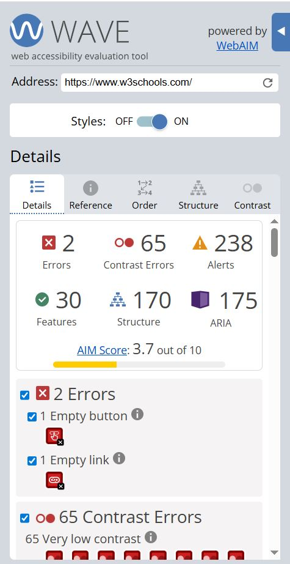

# WAVE Evaluation Tool

**WAVE** visually highlights accessibility issues directly within a web page.

---

## When to use it?

After the development phase for final accessibility testing.

## How to use it

1. Go to: https://wave.webaim.org/  
2. Enter your website URL
3. Review the evaluation results:

In this example, the public website `https://www.w3schools.com/` was used.

## What it shows

- Errors  
- Alerts  
- Page structure (e.g., headings and landmarks)  

## Limitations

- Does not simulate real user behavior  

## Tips & Best Practices 💡

- Use after development  
- Combine with other tools  